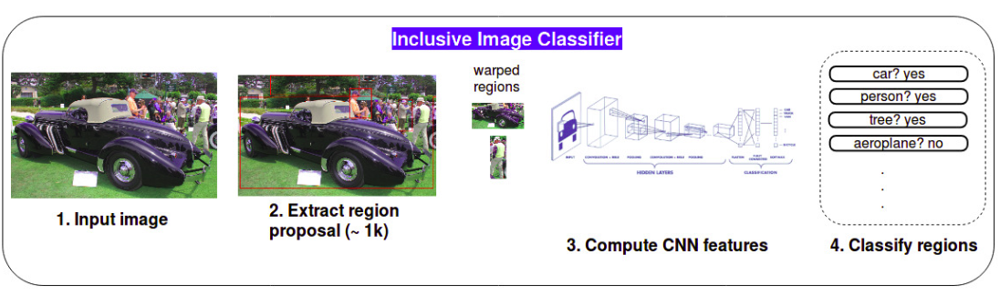
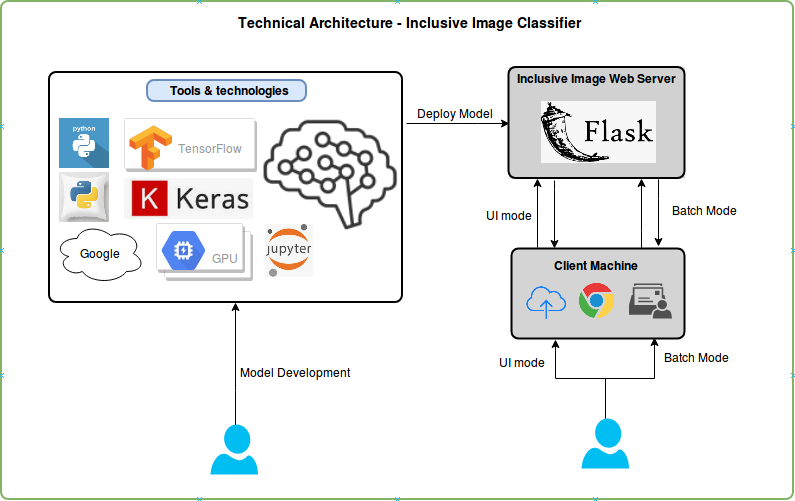

# Inclusive Image Challenge using Deep Learning with CNN Architecture

## Inspired from https://www.kaggle.com/c/inclusive-images-challenge ##

## Data https://www.kaggle.com/c/inclusive-images-challenge/data ##

## Functional Architecture ## 

## Models (under./models, Final cleaned version still to be upload) ##
 * CropnResize Used for preprocssing and did Image crop, resize (256*256) for data preparation
 
 * Helper Python file to help in setting up the functions at better level

 * 7Layer5Conv3DenseBn Custom model developed by our team

 * VGG16TransferLearning as name indicates leveraged the transfer learning with VGG16 (https://github.com/fchollet/deep-learning-models/releases/download/v0.1/vgg16_weights_tf_dim_ordering_tf_kernels_notop.h5)

## Technical Architecture ##

## Metrics ##
* All models are trained for 100 epochs

| Model                | Training Acc  | Validation Acc | Time per Epoch |
| -------------------- | ------------- | -------------  | -------------  | 
| VGG16                | 0.99          | 0.90           | 292 seconds    |
| 7Layer5Conv3DenseBn  | 0.99          | 0.79           | 170 seconds    |
